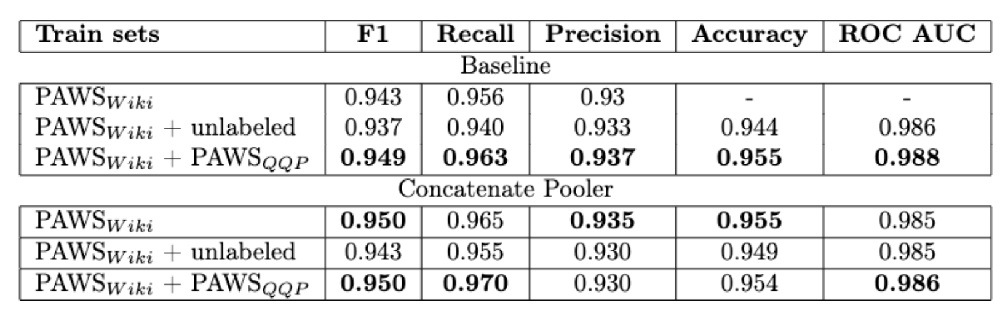

# Paraphrase Detection on PAWS dataset

This project proposes a SOTA solution to the problem of paraphrase identification on [PAWS-Wiki](https://github.com/google-research-datasets/paws) test set. We used Concatenate Pooler with DeBERTa backbone trained on PAWS-Wiki and PAWS-QQP train sets to achieve F1=0.95: improve from 0.943 ([previous SOTA](https://huggingface.co/domenicrosati/deberta-v3-large-finetuned-paws-paraphrase-detector)). Also, we investigate the effects of unlabeled part of PAWS-Wiki.

SOTA run can be found here:
- https://api.wandb.ai/links/crendelyok_team/utm8mtl3
- https://www.kaggle.com/code/nikitapankov/concatenate-pooler-with-qqp?scriptVersionId=130458817

For further details, see the accompanying paper: ["Paraphrase Detection on PAWS dataset"](paper.pdf).



## Setup 
See [notebooks](./notebooks) to find out how to use this repo. 
The code for [training](./src/train.py), [dataset](./src/data.py) and [models](./src/models.py).

We provide a simple framework to train DeBERTav3 with diffrent Pooler Layers on different paraphrase detection datasets.
We use DeBERTAv3 from huggingface and datasets from kaggle (QQP part of PAWS must be unpacked manually due to license).
To use our code you may need:
- kaggle account 
- wandb account

Kaggle allows to use GPU for training and wandb allows to visualize metrics. Just import notebook to kaggle, add WANDB_KEY=\<your key\> and GITHUB_HOST="Sergey-Tkachenko" to kaggle secrets and run every code cell.

## Tips to use this repo
- We provide a simple framework to work with paraphrase detection datasets.
It is easy to add new datasets. See ```PawsParaphraseDataset``` and ```PawsQQPParaphraseDataset``` [here](/src/data.py)

- We provide both W&B and Dummy logger - to run and test your code

- Best checkpoints are saved in checkpoints_folder as "best.tar". You may use this checkpoints to later finetune model. Simply copy one of the checkpoints to checkpoints_folder
